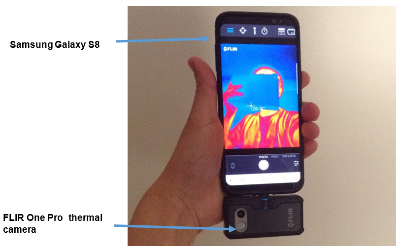

## Remote sensing instruments used in this study

```{r, out.width = "50%", echo=FALSE}
knitr::include_graphics("drone.png") 
 
```

## Pilot study A Deriving turbidity of waterways from UAV-based multispectral camera

### Methodology

**1. Data acquisition**

  + Acquiring multispectral images (Green, Red, Red Edge,NIR) by drone
  + Turbidity and suspended solids water samples from 10 validation points 

**2. Data processing**

  + Creating reflectance maps from the bands in Pix4D Mapper photogrammertry software
  + Georeferencing the reflectance maps to improve projection accuracy
  + Calculate band ratio and band index maps from the reflectance maps
  + Calculate turbidity map using a single band multisensor equation ([Nechad et al., 2009 ](https://www.researchgate.net/publication/252685483_Calibration_and_validation_of_a_generic_multisensor_algorithm_for_mapping_of_turbidity_in_coastal_waters))
  + Extract reflectance data from band ratio, band index and single band turbidity maps

**3. Data analysis**

  + Evaluate and clean remote sensing data
  + Investigate the relationship between reflectance remote sensing data and laboratory results of the turbidity and total suspended solids water samples by using a linear model
  + Validate the correlation between turbidty map (derived from the single band equation) and the laboratory results of the turbidty and total suspended solids

### Study area  

**Lollebeek (51°29'21.0"N, 6°03'18.4"E)**
    
{width="75%"} 

### Reflectance maps 

{width="74%"} 

{width="70%"}


{width="70%"}

### Data analysis

**Descriptive statistics**
```{r, echo=FALSE}
library(magrittr)
library(kableExtra)
library(readxl)
summary_map <- read_excel("summary_map.xlsx")
kable(summary_map, "html") %>%
  kable_styling(bootstrap_options = c("striped", "hover"))
```


