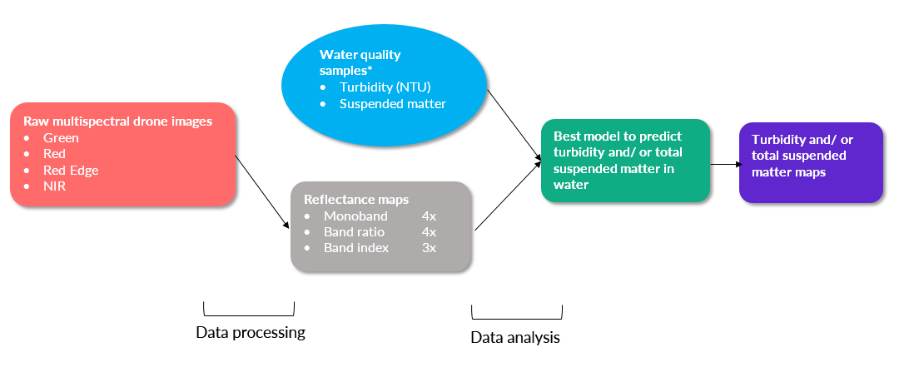
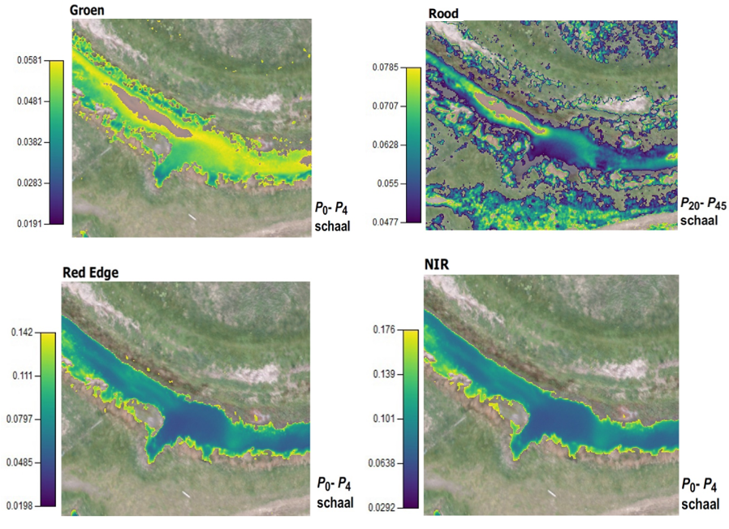
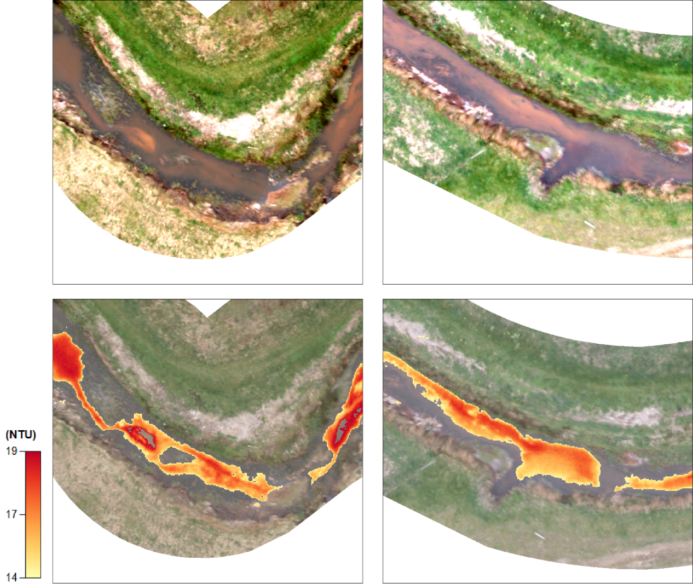

```{r, out.width = "100%", echo=FALSE}
knitr::include_graphics("drone.PNG") 
```

Parrot Sequoia multispectral camera mounted under a drone.

***

###Approach

{width="100%"}

*10 validation points (w1~w10)

**Study area Lollebeek (lat: 51.489167,long: 6.055111)**
    
{width="75%"} 

Field campaign were carried out on April 10, 2018.  

***
### Reflectance maps 

{width="74%"} 


{width="70%"}

{width="70%"}

Calculated band ratio and band index reflectance maps (scale is based on specific percentile range )

***

### Data analysis

**Descriptive statistics**

```{r, echo=FALSE, message=FALSE, warning=FALSE}
library(ggplot2)
library(reshape)
library(gridExtra)
library(dplyr)
library(scales)
library(magrittr)
data <- read.csv("meetpunten.csv")
easy_bp <- function(df,var,x_as,y_as,kleur){
  
  subset <- df[c(var)]
  subset.m <- melt(subset)

  is_outlier <- function(x){
    return(x < quantile(x, 0.25) - 1.5 * IQR(x) | x > quantile(x, 0.75) + 1.5 * IQR(x))
  }
  
  steps <- (max(subset.m$value)-min(subset.m$value))/5
  means <- round(mean(subset.m$value),3)
  means_mu <- paste(c("μ : ",means),collapse=" ")
  medians <- round(median(subset.m$value),2)
  medians_m <- paste(c("M: ",medians),collapse=" ")
  
  subset.m %>%
    group_by(variable)%>%
    mutate(outlier = ifelse(is_outlier(value), value, as.numeric(NA))) %>%
    ggplot(., aes(x = "", y = value))+ 
    scale_y_continuous(labels = round(seq(min(subset.m$value),max(subset.m$value),steps),3),
      breaks=seq(min(subset.m$value),max(subset.m$value),steps),
      limits=c(min(subset.m$value),max(subset.m$value)))+
    geom_boxplot(fill=kleur,colour="#636e72",fatten=NULL)+
    geom_point(color="#636e72",size=1.5)+
    geom_point(aes(y=outlier),color="red",size=1.5)+
    xlab (x_as)+
    ylab (y_as)+ 
    theme_gray()+
    geom_hline(yintercept=medians, linetype="solid",size=0.3,color = "#636e72")+
    geom_text(aes(0,medians,label=medians_m,vjust=-0.5,hjust=0),size=2.5,fontface="italic")
}
red     <- easy_bp(data,"red_mean","Red","Value","#ffeaa7")
rededge <- easy_bp(data,"rededge_me","Red Edge","Value","#ffeaa7")
nir     <- easy_bp(data,"nir_mean","NIR","Value","#ffeaa7")
re_nir  <- easy_bp(data,"re_nir_mea","Red Edge/ NIR","Value","#74b9ff")
r_nir   <- easy_bp(data,"r_nir_mean","Red/ NIR","Value","#74b9ff")
g_nir   <- easy_bp(data,"g_nir_mean","Green/ NIR","Value","#74b9ff")
r_re    <- easy_bp(data,"r_re_mean","Red/ Red Edge","Value","#74b9ff")
ndvi <- easy_bp(data,"ndvi_mean","NDVI","Value","#55efc4")
ndwi <- easy_bp(data,"ndwi_mean","NDWI","Value","#55efc4")
ndre <- easy_bp(data,"ndre_mean","NDRE","Value","#55efc4")
turb    <- easy_bp(data,"ntu_lab","Turbidity (lab)","NTU","#ff7675")
tsm <- easy_bp(data,"tsm_lab","TSM (lab)","mg/l","#ff7675")
grid.arrange(red,rededge,nir,re_nir,r_nir,g_nir,r_re,
             ndvi,ndwi,ndre,turb,tsm,ncol=4)

```

Boxplots from 10 validation points.
M = median 

**Best prediction model**

No relationship can be found between turbidity and suspended matter in our case. However, there is a relationship between turbidity and the Red/ NIR ratio. Three validation points (w2, w4, w7) were excluded to create the linear regression model below. 

```{r, echo=FALSE, message=FALSE, warning=FALSE}
library(plotly)
library(ggplot2)
library(plyr)
easy_lm <- function(df,var_x,var_y,x_as,y_as,kleur,titel) {
  
  ## steps and model
  steps_x <- (max(var_x)-min(var_x))/5
  steps_y <- (max(var_y)-min(var_y))/5

  model <- lm(var_y~var_x)
  dat <- predict(model,interval="confidence")
  data$inside <- ifelse(data$ntu_lab < dat[,"upr"] & data$ntu_lab > dat[,"lwr"], "", as.character(data$label))
  
  subset <- df[c(var_x)]
  subset.m <- melt(subset)

  ##equation stamp
  lm_eqn = function(m) {
    
    l <- list(a = format(coef(m)[1], digits = 2),
              b = format(abs(coef(m)[2]), digits = 2),
              r2 = format(summary(m)$r.squared, digits = 3));
    if ( as.numeric(l[3]) <= 0.001 ){
      l[3] <- as.character(round(as.numeric(l[3])),3)
    }
    
    if (coef(m)[2] >= 0)  {
      eq <- substitute(italic(y) == a + b %.% italic(x)*","~~italic(R)^2~"="~r2,l)
    } else {
      eq <- substitute(italic(y) == a - b %.% italic(x)*","~~italic(R)^2~"="~r2,l)    
    }
    
    as.character(as.expression(eq));                 
  }
  
  ##plotting
  ggplot(df,aes(x=var_x,y=var_y)) +
    stat_smooth(method=lm,color=kleur,fullrange=TRUE)+
    scale_x_continuous(labels = round(seq(min(var_x),max(var_x),steps_x),3),
                       breaks=seq(min(var_x),max(var_x),steps_x))+
    scale_y_continuous(labels = round(seq(min(var_y),max(var_y),steps_y),3),
                       breaks=seq(min(var_y),max(var_y),steps_y))+
    geom_point(color="#34495e",alpha=0.8) + geom_line(color="#34495e",alpha=1,linetype="dotted")+
    xlab (x_as)+
    ylab (y_as)+ 
    theme_grey()+
    annotate("text",x=-Inf,y=Inf,label=lm_eqn(model),hjust=-0.75,vjust=1.0,parse=TRUE,size=4)+
    geom_text(aes(label=data$inside,hjust=0.5,vjust=-0),size=4,color="#e74c3c",fontface="bold")+
    theme(axis.text=element_text(size=12))+
    labs(title=titel)+
    scale_size_area()
}
data <- read.csv("meetpunten.csv")
data <- data[-c(7,4,2),]
r_nir <- easy_lm(data,data$r_nir_mean,data$ntu_lab,"Value Red/ NIR","Turbidity (NTU)(lab)", "#3498db","Model with 7 validation points")
r_nir
```


**Turbidity equation**

Based on the previous regression model the following turbidity equation can be derived:

$Turbidity (NTU) = 5.6 +13.4(\frac{Red}{NIR}) \pm 0.7$

***

### Turbidity map

Applying the turbidity equation to the Red/ NIR ratio reflectance map resulted into the turbidity coverage map below. The turbidity range scales from 14 to 19 NTU (darkest to brightest colour)

**Interactive turbidity map**

<iframe width="100%" height="650px" src="turbidity_mapview2.html" frameborder="0" allowfullscreen></iframe>


{width="75%"}

Turbidity map zoomed on two locations


