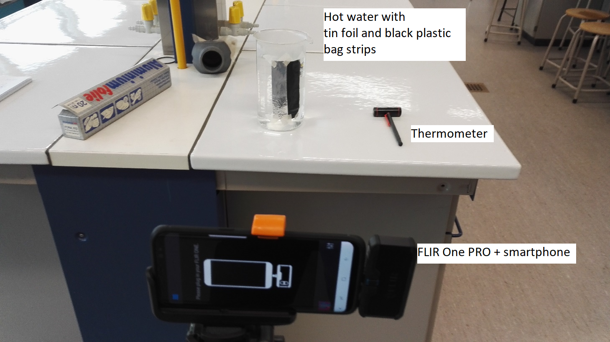

```{r, out.width = "100%", echo=FALSE}
knitr::include_graphics("flir.png") 
```
*FLIR One Pro thermal camera attached on a Samsung Galaxy S8 smartphone.* 

***

###Field experiments

**Interactive map with field experiment results**

<iframe width="75%" height="500" src="thermal_leaflet.html" frameborder="0" allowfullscreen></iframe>

[Click here for a full screen preview ](https://williamtjiong.github.io/remotesensing/thermal_leaflet.html)


{width="40%"} {width="40%"}

FLIR one Pro thermal camera setup for the drone experiment

**Thermal images from field experiments**

{width="75%"}
{width="75%"}
{width="37.2%"} {width="37.2%"}

{width="37.2%"} {width="37.2%"}

Solar reflectance can be observed on some of the thermal images above.

***

###Laboratory experiments

**Setup**

{width="75%"}

{width="75%"}

{width="75%"}

**Thermal images from laboratory experiments**

{width="75%"}
{width="75%"}

Observed temperature differences from the thermal images
